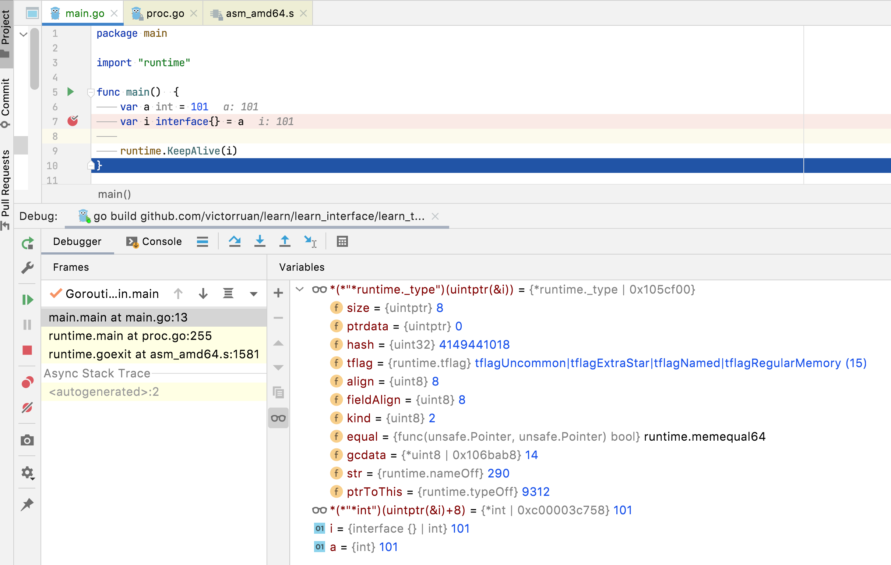
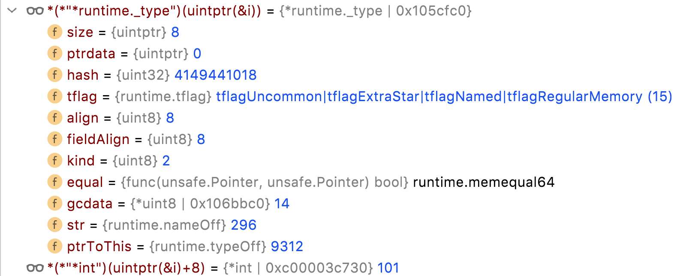
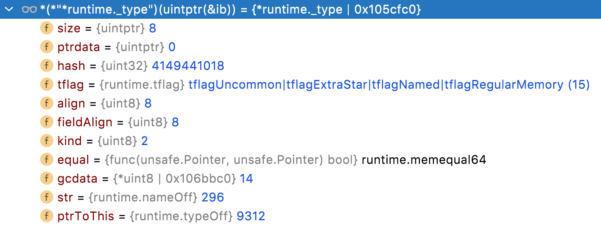
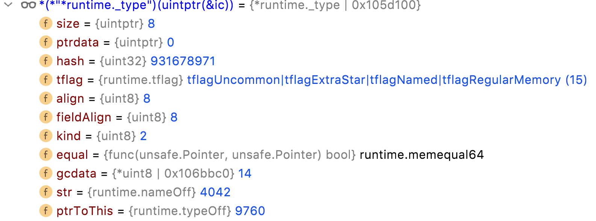
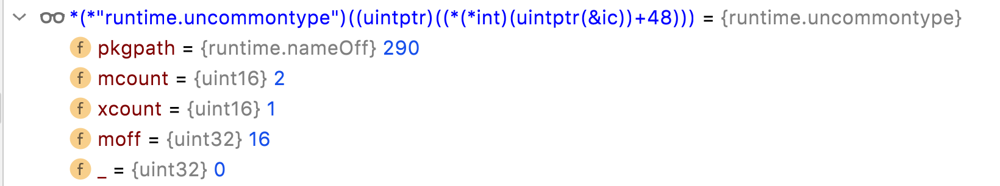

# [类型系统还挺重要](https://www.bilibili.com/video/BV1iZ4y1T7zF?p=1)

## 内置类型

- int
- string
- slice
- map
- func
- ....

## 自定义类型

```go
type T int

type T struct{
name string
}

type I interface{
Name() string
}
```

## 类型元数据

给内置类型定义方法是不被允许的

数据类型虽然多，但是不管是内置类型还是自定义类型都有对应的类型描述信息

称之为它的 `类型元数据`，每种类型元数据都是全局唯一的，

这些类型元数据共同组成了go的类型系统

### 类型元数据 runtime._type 包含的信息

- 类型大小
- 类型的名称
- 对齐边界
- 是否自定义
- ......

#### src/runtime/type.go

```
type _type struct {
	size       uintptr
	ptrdata    uintptr // size of memory prefix holding all pointers
	hash       uint32
	tflag      tflag
	align      uint8
	fieldAlign uint8
	kind       uint8
	......
	str       nameOff
	......
}
```

我们可以通过强大的GoLand来尝试偷窥int的类型元数据,对下面的代码打断点进入调试阶段

然后添加变量Watch表达式：

- ```*(*"*runtime._type")(uintptr(&i))```
- ```*(*"*int")(uintptr(&i)+8)```

```
func main()  {
	var a int = 101
	var i interface{} = a

	// *(*"*runtime._type")(uintptr(&i))
	// *(*"*int")(uintptr(&i)+8)

	runtime.KeepAlive(i)
}

```



可以看到上图中:
1. size=8 ; 代表int类型的大小是8个字节
2. align=8; 代表8字节对齐
3. kind=2; `kindInt`的枚举值就是2
4. equal=runtime.memequal64; 代表int用的等值判断方法
5. str = 290 ; 是用来获取类型名称的偏移量
6. `*(*"*int")(uintptr(&i)+8) = 101` ;空接口interface底层 eface.data = *(&eface+8)

```go
func memequal64(p, q unsafe.Pointer) bool {
	return *(*int64)(p) == *(*int64)(q)
}
```

#### _type.nameoff 可以获取 runtime.name  
```go
func (t *_type) nameOff(off nameOff) name {
	return resolveNameOff(unsafe.Pointer(t), off)
}

func resolveNameOff(ptrInModule unsafe.Pointer, off nameOff) name {
	if off == 0 {
		return name{}
	}
	base := uintptr(ptrInModule)
	for md := &firstmoduledata; md != nil; md = md.next {
		if base >= md.types && base < md.etypes {
			res := md.types + uintptr(off)
			if res > md.etypes {
				println("runtime: nameOff", hex(off), "out of range", hex(md.types), "-", hex(md.etypes))
				throw("runtime: name offset out of range")
			}
			return name{(*byte)(unsafe.Pointer(res))}
		}
	}

	// No module found. see if it is a run time name.
	reflectOffsLock()
	res, found := reflectOffs.m[int32(off)]
	reflectOffsUnlock()
	if !found {
		println("runtime: nameOff", hex(off), "base", hex(base), "not in ranges:")
		for next := &firstmoduledata; next != nil; next = next.next {
			println("\ttypes", hex(next.types), "etypes", hex(next.etypes))
		}
		throw("runtime: name offset base pointer out of range")
	}
	return name{(*byte)(res)}
}
```

#### runtime.name
下面分析runtime.name
将注释直接写在代码里
```go
// name is an encoded type name with optional extra data.
// See reflect/type.go for details.
type name struct {
	bytes *byte
}

func (n name) data(off int) *byte {
	return (*byte)(add(unsafe.Pointer(n.bytes), uintptr(off)))
}

func (n name) isExported() bool {
	return (*n.bytes)&(1<<0) != 0
}

func (n name) readvarint(off int) (int, int) {
	v := 0
	for i := 0; ; i++ {
		x := *n.data(off + i)
		v += int(x&0x7f) << (7 * i)
		if x&0x80 == 0 {
			return i + 1, v
		}
	}
}

func (n name) name() (s string) {
	if n.bytes == nil {
		return ""
	}
	i, l := n.readvarint(1)
	if l == 0 {
		return ""
	}
	hdr := (*stringStruct)(unsafe.Pointer(&s))
	hdr.str = unsafe.Pointer(n.data(1 + i))
	hdr.len = l
	return
}

func (n name) tag() (s string) {
	if *n.data(0)&(1<<1) == 0 {
		return ""
	}
	i, l := n.readvarint(1)
	i2, l2 := n.readvarint(1 + i + l)
	hdr := (*stringStruct)(unsafe.Pointer(&s))
	hdr.str = unsafe.Pointer(n.data(1 + i + l + i2))
	hdr.len = l2
	return
}

func (n name) pkgPath() string {
	if n.bytes == nil || *n.data(0)&(1<<2) == 0 {
		return ""
	}
	i, l := n.readvarint(1)
	off := 1 + i + l
	if *n.data(0)&(1<<1) != 0 {
		i2, l2 := n.readvarint(off)
		off += i2 + l2
	}
	var nameOff nameOff
	copy((*[4]byte)(unsafe.Pointer(&nameOff))[:], (*[4]byte)(unsafe.Pointer(n.data(off)))[:])
	pkgPathName := resolveNameOff(unsafe.Pointer(n.bytes), nameOff)
	return pkgPathName.name()
}

func (n name) isBlank() bool {
	if n.bytes == nil {
		return false
	}
	_, l := n.readvarint(1)
	return l == 1 && *n.data(2) == '_'
}

```

观察上面的代码，runtime.name 实际上是一个字节数组的地址，
字节数组的第一个字节是标记字节

1. 从isExported 方法可以看出1<<0代表类型是否导出 
2. 从tag 方法可出1<<1代表类型是否包含tag
3. 从pkgPath 方法可以看出1<<2代表类型是否包含pkgPath

### int,aliasint,myint 对比
```go
package main

import "runtime"

type AliasInt = int
type MyInt int

func main()  {
	var (
		a int = 101
		b AliasInt = 102
		c MyInt = 103
	)
	var i interface{} = a
	var ib interface{} = b
	var ic interface{} = c
	// *(*"*runtime._type")(uintptr(&i))
	// *(*"*int")(uintptr(&i)+8)
	// *(*"*runtime._type")(uintptr(&ib))
	// *(*"*int")(uintptr(&ib)+8)
	// *(*"*runtime._type")(uintptr(&ic))
	// *(*"*int")(uintptr(&ic)+8)
	runtime.KeepAlive(i)
	runtime.KeepAlive(ib)
	runtime.KeepAlive(ic)
}
```
如上我们定义了`AliasInt`、`MyInt`,我们分别来观察下它们的类型元数据

| int元数据 | AliasInt | MyInt |
| :-----| :----: | :----: |
|  |   |  |

通过对比hash值可以得出结论
1. type AliasInt = int; 这种写法，AliasInt 与 int 等价
2. type MyInt int; 这种写法，MyInt 自立门户，重新定义了一个元数据


runtime._type实际上是每个类型元数据的header， 对于slicetype，除了会存slice本身的类型元数据 还会存slice所存数据的类型元数据的指针信息

```
type slicetype struct {
	typ  _type
	elem *_type
}
```

如果是 []string ,那么elem就指向string类型的类型元数据 string type

```
type uncommontype struct {
	pkgpath nameOff
	mcount  uint16 // number of methods
	xcount  uint16 // number of exported methods
	moff    uint32 // offset from this uncommontype to [mcount]method
}
```

### uncommontype 
如果是自定义类型,类型元数据里还会存 一个uncommontype的结构体

- pkgpath是类型所在的包路径
- mcount是方法的数量
- xcount是导出方法的数量,大写方法的数量
- moff是方法地址偏移量

我们来看这样一段代码,通过上面的调试方法,写出watch表达式
> *(*"runtime.uncommontype")((uintptr)((*(*int)(uintptr(&ic))+48))) 
> 
需要注意+48 实际上是加的 sizeof(runtime._type)

```
package main

import "runtime"

type AliasInt = int
type MyInt int

func (i MyInt) GetName() string {
	return "MyInt"
}

func (i MyInt) setName(name string )  {

}

func main() {
	var (
		a int      = 101
		b AliasInt = 102
		c MyInt    = 103
	)
	var i interface{} = a
	var ib interface{} = b
	var ic interface{} = c
	// *(*"*runtime._type")(uintptr(&i))
	// *(*"*int")(uintptr(&i)+8)
	// *(*"*runtime._type")(uintptr(&ib))
	// *(*"*int")(uintptr(&ib)+8)
	// *(*"*runtime._type")(uintptr(&ic))
	// *(*"*int")(uintptr(&ic)+8)
	// *(*"runtime.uncommontype")((uintptr)((*(*int)(uintptr(&ic))+48)))
	runtime.KeepAlive(i)
	runtime.KeepAlive(ib)
	runtime.KeepAlive(ic)
}

```



观察上图,
1. mcount=2 代表方法数量为2
2. xcount=1 代表导出数量为1
3. moff=16 代表方法偏移量为16

### 再举个自定义类型的例子

```go
type myslice []string

func (ms myslice) Len()  {
...
}

func (ms myslice) Cap()  {
...
}
```

slicetype = _type + stringtype

myslice的类型元数据 = slicetype+uncommontype

`&uncommontype+moff`就是myslice关联的方法数组 Len,Cap 