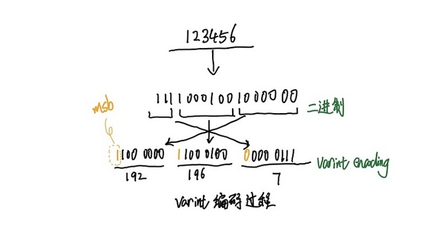

[详解varint编码原理](https://segmentfault.com/a/1190000020500985?utm_source=tag-newest)
========================================================================

什么是Varint编码
----------------
1. Varint是一种使用一个或多个字节序列化整数的方法,会把整数编码为变长字节。
2. 对于32位整型数据经过Varint编码后需要1~5个字节,小的数字使用1个byte,大的数字使用5个bytes。
3. 64位整型数据编码后占用1~10个字节。
4. 在实际场景中小数字的使用率远远多于大数字,因此通过Varint编码对于大部分场景都可以起到很好的压缩效果

编码原理
----------------
1. 除了最后一个字节外，varint编码中的每个字节都设置了最高有效位（most significant bit - msb）
2. msb为1则表明后面的字节还是属于当前数据的,如果是0那么这是当前数据的最后一个字节数据。
3. 每个字节的低7位用于以7位为一组存储数字的二进制补码表示，最低有效组在前，或者叫最低有效字节在前。
4. 这表明varint编码后数据的字节是按照小端序排列的。

看图理解:


图中对数字123456进行varint编码，123456用二进制表示为`1 11100010 01000000`，
每次低从向高取7位再加上最高有效位变成`1100 0000 11000100 00000111`
所以经过varint编码后123456占用三个字节分别为`192 196 7`。

解码的过程就是将字节依次取出，去掉最高有效位，
因为是小端排序所以先解码的字节要放在低位，
之后解码出来的二进制位继续放在之前已经解码出来的二进制的高位最后转换为10进制数完成varint编码的解码过程。
也就是说解码过程，从左往右，判断msb==0，就停止

Go编解码实现
----------------
文件: src/encoding/binary/varint.go
```go
// PutUvarint encodes a uint64 into buf and returns the number of bytes written.
// If the buffer is too small, PutUvarint will panic.
func PutUvarint(buf []byte, x uint64) int {
	i := 0
	for x >= 0x80 {
		buf[i] = byte(x) | 0x80
		x >>= 7
		i++
	}
	buf[i] = byte(x)
	return i + 1
}
```
上面的编码过程很简单:
1. 如果x<128，x的最高位肯定为0，则直接将x存起来，标记位为0，退出
2. 如果x>=128,x的最高位肯定不为0，则将x存起来，标记位为1，继续执行第3步
3. 将x右移7位,因为第2步已经将低7位保存了,这里移除低7位,继续跳到第1步执行

```go
// Uvarint decodes a uint64 from buf and returns that value and the
// number of bytes read (> 0). If an error occurred, the value is 0
// and the number of bytes n is <= 0 meaning:
//
// 	n == 0: buf too small
// 	n  < 0: value larger than 64 bits (overflow)
// 	        and -n is the number of bytes read
//
func Uvarint(buf []byte) (uint64, int) {
	var x uint64
	var s uint
	for i, b := range buf {
		if i == MaxVarintLen64 {
			// Catch byte reads past MaxVarintLen64.
			// See issue https://golang.org/issues/41185
			return 0, -(i + 1) // overflow
		}
		if b < 0x80 {
			if i == MaxVarintLen64-1 && b > 1 {
				return 0, -(i + 1) // overflow
			}
			return x | uint64(b)<<s, i + 1
		}
		x |= uint64(b&0x7f) << s
		s += 7
	}
	return 0, 0
}
```
解码过程也比较简单
1. 循环字节数组，判断字节是否最高位==0
2. 如果最高位==0，解码完成，退出
3. 如果最高位==1，取该字节低7位，继续执行第1步