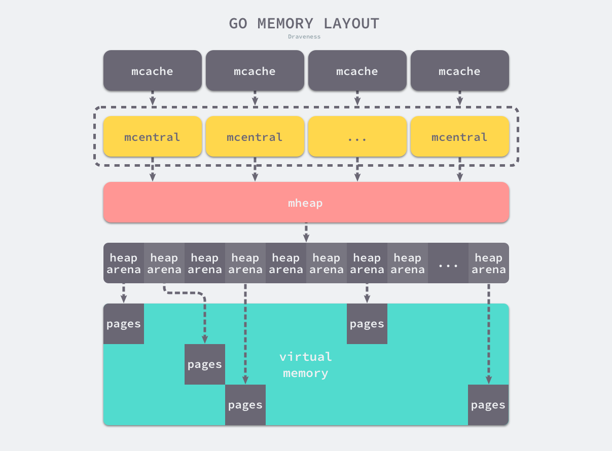

# Go内存布局

所有的Go程序都会在启动时初始化上图所示的内存布局。每个处理器P都会持有一个`mcache`,用于处理微对象和小对象的分配。`mcache`会持有`68*2`个内存管理单元 `runtime.mspan`

`mspan`会管理固定大小`size`的对象,它包含`npages`的页内存,每页是8k,所以`对象总数 = (npages*pagesize)/size`

当`mspan`中不存在空闲对象可以分配时,就会向`mcentral`申请一个新的`mspan`替换当前的

每个`mcentral`会管理特定大小的对象。它属于全局对象mheap的一个mcentral数组。

真正向操作系统申请内存的工作，是由`mheap`完成的

在`Linux`的`Amd64`操作系统上，`mheap`会持有`4,194,304`个`heapArena`,每个`heapArena`会管理64M内存,单个Go程序的内存上限是 4194304*64M = 256T

