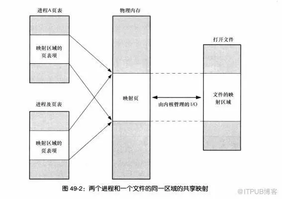

# mmap
想要了解Go是如何从操作系统申请内存的，就必须要了解`mmap`是什么

在`LINUX`中我们可以使用`mmap`在进程虚拟内存地址空间中分配 一段 地址空间，
创建和物理内存的映射关系。

## 映射关系又可以分为两种  
1. 文件映射
> 磁盘文件映射进程的虚拟地址空间，使用文件内容初始化物理内存。

2. 匿名映射(Go申请内存使用这个)
> 初始化全为0的内存空间。

## 而对于映射关系是否共享又分为
1. 私有映射(MAP_PRIVATE)(Go申请内存使用这个)
> 多进程间数据共享，修改不反应到磁盘实际文件
2. 共享映射(MAP_SHARED)
> 多进程间数据共享，修改反应到磁盘实际文件中

## 因此总结起来有4种组合
1. 私有文件映射
> 多个进程使用同样的物理内存页进行初始化，但是各个进程对内存文件的修改不会共享，也不会反应到物理文件中.

2. 私有匿名映射(Go申请内存使用这个)
> mmap会创建一个新的映射，各个进程不共享，这种使用主要用于分配内存(malloc分配大内存会调用mmap)。

3. 共享文件映射
> 多个进程通过虚拟内存技术共享同样的物理内存空间，对内存文件 的修改会反应到实际物理文件中。

4. 共享匿名映射
> 这种机制在进行fork的时候不会采用写时复制，父子进程完全共享同样的物理内存页，这也就实现了父子进程通信(IPC).

