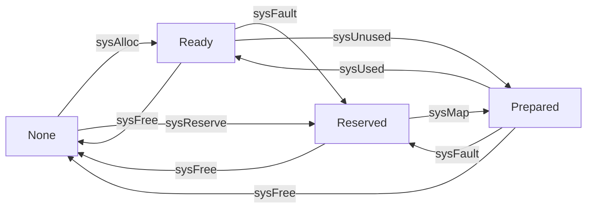

# 地址空间

Go中所有的内存，最终都是要向操作系统申请的。所以Go运行时构建了操作系统内存管理抽象层。该抽象层将运行时管理的地址空间分成了4种状态：

|状态	|解释|
|----|----|
|None|内存没有被保留或者映射，是地址空间的默认状态|
|Reserved|运行时持有该地址空间，但是访问该内存会导致错误|
|Prepared|内存被保留，一般没有对应的物理内存，访问该片内存的行为是未定义的，可以快速转换到 Ready 状态|
|Ready|可以被安全访问|

**表1 地址空间的状态**

**图1 地址空间的状态转换**

运行时中封装了操作系统对上述地址空间状态转换的方法，所有的方法都包含在`runtime/mem_*.go`的文件中,linux相关的实现都在文件是`src/runtime/mem_linux.go`

- `runtime.sysAlloc`  会从操作系统中获取一大块可用的内存空间
- `runtime.sysFree`  返还内存给操作系统
- `runtime.sysReserve`  会保留一片内存区域,访问这片内存会触发异常
- `runtime.sysMap`  保证内存区域可以快速转换至就绪状态

运行时使用 Linux 提供的 `mmap`、`munmap` 和 `madvise` 等系统调用实现了操作系统的内存管理抽象层，抹平了不同操作系统的差异，为运行时提供了更加方便的接口
